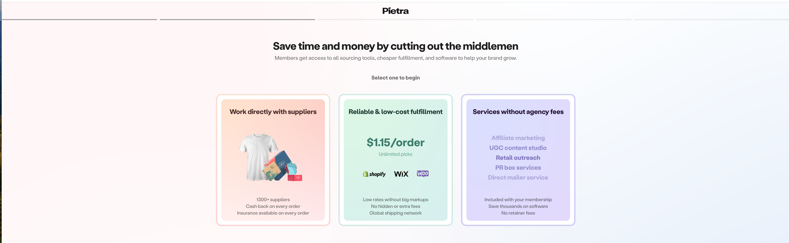

# 一个 undefined 引发的惨案

近日在写代码的过程中遇到了一个非常诡异的 bug。经过几个小时的排查，最终查出背后原因，竟和 `undefined` 有关。

## 实际场景

大致背景是，用户在首次注册登录之后，会进入一个引导页面，这个引导页面主要是引导用户填写一些基础的信息，整个流程我们将其称之为 `onboarding`， 我们把整个流程分为5个步骤。在页面顶部会有步骤条显示，如下图所示：



我们将整个 `onboarding` 的信息都存在一个 `React State` 中：

```tsx
const [onboarding, setOnboarding] = useState<Onboarding | null>({ currentStep: 1 })

...
// onboarding的类型如下
export interface Onboarding {
  currentStep?: number;
  goal?: UserGoalType;
  formFields?: {
    [key: string]: any;
  };
}
```

每次完成一个步骤，就会把 `onboarding.currentStep` 进行 + 1操作，从而跳转到下一个步骤：

```tsx
setOnboarding((prevOnboarding) => ({
  ...prevOnboarding,
  currentStep: currentStep + 1,
}))
```

同时我们会实时记录 `onboarding` 的所有信息(以便用户刷新页面或者下一次进入网站能够回到上一次操作的步骤)，将其同步至云端：

```tsx
useEffect(() => {
  // 在 fetchStep 函数中获取云端数据，setOnboarding 数据
  fetchStep()
}, [])

useEffect(() => {
  saveOnboardingData(onboarding)
}, [onboarding, saveOnboardingData])
```

然后根据 `onboarding.currentStep` 的值渲染每个步骤：

```tsx
const renderStepPage = useCallback(() => {
  switch (onboarding?.currentStep) {
    case 1:
      return <Step1Page />
    case 2:
      return <Step2Page />
    case 3:
      return <Step3Page />
    case 4:
      return <Step4Page />
    case 5:
      return <Step5Page />
    default:
      return null
  }
}, [onboarding])
```

## bug出现了

该组件在第一次执行的时候，React 会将 `onboarding.currentStep` 初始化为1，按道理此时应该出现渲染 <Step1Page />，但是实际发现页面是空白的。经过我的排查，发现是因为 `fetchStep` 函数的问题，因为第一次加载的时候，`onboarding.currentStep` 的确初始化为1了，但是随着 `useEffect` 的执行，`fetchStep` 也会被执行，第一次执行的时候，云端是没有 `currentStep` 数据的，云端返回的是一个空值，但是我仍然执行了 `setOnboarding`，所以导致 `onboarding.currentStep` 为空，所以页面未按预期正常渲染。

知道了这个问题，解决就很简单了，在 `fetchStep` 里面 执行 `setOnboarding` 的时候略微处理一下，同时在渲染的时候进行兜底处理：

```tsx
setOnboarding((prevOnboarding) => ({ ...prevOnboarding, ...onboarding }))

...
const renderStepPage = useCallback(() => {
  switch (onboarding?.currentStep || 1) {
    case 1:
      return <Step1Page />
    case 2:
      return <Step2Page />
    case 3:
      return <Step3Page />
    case 4:
      return <Step4Page />
    case 5:
      return <Step5Page />
    default:
      return null
  }
}, [onboarding])
```

`prevOnboarding` 会保留之前初始化的值，`onboarding` 会依次覆盖，第一次初始化的时候，`prevOnboarding` 里面会有初始化的1，`onboarding` 为空值，这个时候就不会出现上述情况。 改好了之后，我在本地刷新代码，确实按照预期正常渲染了。我以为这个 bug 就这样解决了，于是我高高兴兴的将代码推送到仓库。

## 再战一次

提交代码至仓库，等待流水线打包部署完成之后，接着我去测试链接进行测试，结果我傻了。初次进入页面，<Step1Page /> 确实按照预期渲染了，但是我发现在 <Step1Page />点击进入下一步时，我发现点击无效，点击居然没有任何反应？然后我抱着试一试的想法，刷新了一下页面，结果怎么着？居然又可以正常点击了。。。于是就出现了一个非常玄学的问题：

第一次进入的时候，无法点击进入下一步，在当前页面刷新之后，又可以正常点击进入下一步。

这个现象真的让我百思不解，不明白到底是哪里出了问题，代码提交有误？打包编译问题？部署缓存问题？本地缓存问题？

## undefined 的锅

我试着按照我之前的思路逐个进行排查，最终我发现居然是 `undefined` 导致的这个问题。怎么回事呢，听我慢慢道来。第一次初始化的时候，`fetchStep` 里面 执行 `setOnboarding` 的时候，把 `onboarding.currentStep` 设置为 `undefined` 了，当我们点击 + 1的时候， `undefined + 1 = NaN`，这个时候不就没反应了吗。。。那为什么刷新一下又可以了呢？原来刷新页面之后， `onboarding.currentStep` 又被设置为 `null` 了，而 `null + 1 = 1`，所以这就是问题所在。

那为什么在我本地没有问题呢，因为我本地有热更新，`onboarding.currentStep` 会一直被设置成 `null`，我还傻傻以为是正常的1。最终的解决方法就是在 `fetchStep` 里面判断是否有值，如果没有值，就直接将 `onboarding.currentStep` 设置为1。

```tsx
undefined + 1 = NaN

null + 1 = 1
```

## 万丈高楼平地起

js隐式类型转换是基础，所以掌握好基础，真的是前端工程师最最重要的一环，所以我们再一起复习一下吧：


