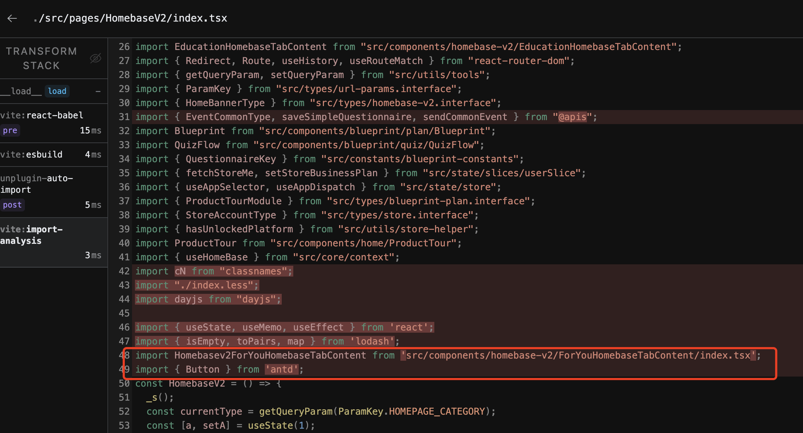
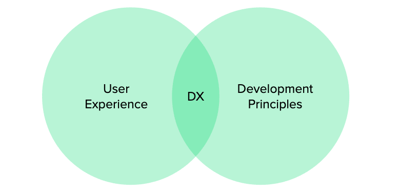

# pietra auto import

`@pietra/auto-import` 是一个Vite Plugin，它可以让我们在项目中自动引入一些顶级的库或者工具，例如 Antd, Lodash, React API 等等。

## 现状

开始正式介绍之前，我们先来看看pietra creator项目中随便一个文件的顶部的 `import`:

```ts
import { lazy, useEffect, useMemo, useRef } from 'react'
import HomeBanner from 'src/components/homebase-v2/HomeBanner'
import { Redirect, Route, useHistory, useRouteMatch } from 'react-router-dom'
import { getQueryParam, setQueryParam } from 'src/utils/tools'
import { ParamKey } from 'src/types/url-params.interface'
import { HomeBannerType } from 'src/types/homebase-v2.interface'
import {
  EventCommonType,
  saveSimpleQuestionnaire,
  sendCommonEvent,
} from '@apis'
import _ from 'lodash'
import Blueprint from 'src/components/blueprint/plan/Blueprint'
import QuizFlow from 'src/components/blueprint/quiz/QuizFlow'
import { QuestionnaireKey } from 'src/constants/blueprint-constants'
import { fetchStoreMe, setStoreBusinessPlan } from 'src/state/slices/userSlice'
import { useAppSelector, RootState, useAppDispatch } from 'src/state/store'
import { SimpleQuestionnaireInputItem } from 'src/types/api/store.interface'
import {
  BusinessPlan,
  ProductTourModule,
} from 'src/types/blueprint-plan.interface'
import { StoreAccountType, StoreMe } from 'src/types/store.interface'
import { hasUnlockedPlatform } from 'src/utils/store-helper'
import ProductTour from 'src/components/home/ProductTour'
import { useHomeBase } from 'src/core/context'
import cN from 'classnames'
import { includes } from 'lodash'
import './index.less'
import dayjs from 'dayjs'
```

这么一看，import 的代码竟然占据了29行。我们先来分析一下，除了我们导入内部的文件之外（src文件夹下），其他的基本上都是非常通用的导入，例如：

```ts
import { lazy, useEffect, useMemo, useRef } from 'react'
import { Redirect, Route, useHistory, useRouteMatch } from 'react-router-dom'
import cN from 'classnames'
import { includes } from 'lodash'
```

这些都是来自使用频率非常高的第三方库，我们每次都需要重复书写这些代码，那么有没有办法能够自动导入这些库呢？

## 理想的使用方式

什么是自动导入？即是说不用手动书写以上这些 import 语句，直接在代码中使用对应的 API，例如：

```tsx
// without these code:
// import { map } from "lodash"
// import { Button } from "antd"
// import { useState, useEffect } from "react"

function Example() {
  const [count, setCount] = useState(0)

  useEffect(() => {
    const arr = [1, 2, 3, 4, 5]
    map(arr, (item) => {
      console.log('item:', item)
    })
  }, [])

  return (
    <>
      <Button type="primary" />
    </>
  )
}
```

事实上，在 pietra 项目中我们频繁使用的第三方库包括: react, react-router, react-router-dom, antd, lodash, classnames 等等（暂且统计这6个），如果这些库都能做到自动导入那就非常棒了。

## 更进一步

我们接着分析，除了第三方库之外，可以发现其实我们在顶部也导入了很多内部文件，例如 `src/components` 等。如果也能自动导入，那就更棒了！

```tsx
// without these code:
// import IconsArrowButtonRightIcon from 'src/components/icons/ArrowButtonRightIcon';
// import ForYouHomebaseTabContent from 'src/components/homebase-v2/ForYouHomebaseTabContent';

function Example() {
  ...
  return (
    <>
    <IconsArrowButtonRightIcon />
    <ForYouHomebaseTabContent />
    </>
  )
}
```

这个时候，你可能会想我们现在的项目都是用 typescript 写的，如果没有import语句，eslint 会提示 `no-undef`的错误， 如果我们能一并解决这个问题那就更好了！

## @pietra/auto-import

为了解决以上我们提出的问题， `@pietra/auto-import`来了。接下来正式介绍 `@pietra/auto-import` 的使用：

```bash
yarn add @pietra/auto-import -D
```

```ts
//vite.config.ts
import { pietraAutoImport } from '@pietra/auto-import'

// https://vitejs.dev/config/
export default defineConfig({
  plugins: [
    ...pietraAutoImport({
      include: [/\.[tj]sx?$/],
      dts: './pietra-auto-imports.d.ts',
      eslintrc： './.eslintrc-pietra-auto-import.json',
      presets: {
        react: true,
        reactRouter: true,
        antd: true,
        lodash: true,
        classnames: true,
        reactRouterDom: true,
        pietraCompoent: true,
      },
    }),
  ],
})
```

介绍一下每个字段的含义：

- `include`: 用于匹配需要做自动导入的文件类型。
- `d.ts` 和 `eslintrc`: 刚刚提到，我们同时也要解决 eslint 报错的问题。对于这个问题，我们会通过 `dts` 字段指定一个后缀为 `d.ts` 的文件名，`eslintrc`指定一个后缀为 `.json` 的文件名，当我们运行或者打包的时候，会在指定位置生成对应的文件，我们只需要把 `./pietra-auto-imports.d.ts` 文件加入到 `tsconfig`的 `include`, 把 `./.eslintrc-pietra-auto-import.json` 文件加入到 `.eslintrc.js` 即可：

```json
// tsconfig.json
{
  ...
  "include": [
    "./src",
    "types.d.ts",
    "pietra-auto-imports.d.ts",
    "tests"
  ]
}
```

```js
// .eslintrc.js
module.exports = {
 ...
  extends: [
    'eslint:recommended',
    'plugin:@typescript-eslint/recommended',
    'react-app',
    'plugin:prettier/recommended',
    'plugin:react-hooks/recommended',
    'prettier',
    './.eslintrc-pietra-auto-import',
  ],
  ...
};
```

生成的 `./pietra-auto-imports.d.ts` 代码示例如下：

```ts
/* eslint-disable */
/* prettier-ignore */
// @ts-nocheck
// noinspection JSUnusedGlobalSymbols
// Generated by @pietra/auto-import
export {}
declare global {
  const Count: typeof import("@/components/Count.tsx")["Count"];
  const createRef: typeof import("react")["createRef"];
  const forwardRef: typeof import("react")["forwardRef"];
  const lazy: typeof import("react")["lazy"];
  const memo: typeof import("react")["memo"];
  const startTransition: typeof import("react")["startTransition"];
  const useCallback: typeof import("react")["useCallback"];
  const useContext: typeof import("react")["useContext"];
  const useDebugValue: typeof import("react")["useDebugValue"];
  const useDeferredValue: typeof import("react")["useDeferredValue"];
  const useEffect: typeof import("react")["useEffect"];
  const useHref: typeof import("react-router")["useHref"];
  const useId: typeof import("react")["useId"];
  const useImperativeHandle: typeof import("react")["useImperativeHandle"];
  ...
}
```

生成的 `./.eslintrc-pietra-auto-import.json` 代码示例如下：

```json
{
  "globals": {
    ...
    "useRef": true,
    "useResolvedPath": true,
    "useRoutes": true,
    "useSearchParams": true,
    "useState": true,
    "useSyncExternalStore": true,
    "useTransition": true,
    ...
  }
}
```

- `presets`: 表示需要自动导入的库。（`pietraCompoent: true` 表示自动导入 `src/components`目录下面的组件）。

## 简单讲一下原理

现代的前端项目几乎都是基于构建工具之上的，例如 Webpack、Vite、Rollup、ESbuild 等等。这些工具的主要作用是打包代码。而打包代码会经历好几个阶段：词法分析、语法分析、代码优化阶段、代码生成阶段等。

- 词法分析（Lexical Analysis）：这个阶段，构建工具会将源代码转换为一个个标记（Token），这些标记是代码中最小的有意义单位，如关键字、变量名、操作符等。

- 语法分析（Syntax Analysis）：接下来，工具会根据词法分析得到的标记构建出抽象语法树（AST），这棵树表示了代码的语法结构。

- 优化（Optimization）：在此阶段，工具会对代码进行各种优化操作，例如进行代码压缩、执行代码分割（Code Splitting）等。

- 代码生成（Code Generate）：最后，构建工具会将优化后的抽象语法树转换为目标代码，这可能是浏览器可以直接运行的 JavaScript 代码，也可能是某种中间代码或其他格式的输出。

`@pietra/auto-import` 主要作用在语法分析（Syntax Analysis）分析阶段，这个阶段在构建工具中一般称为 `transform`，当我们过滤出指定的文件之后，我们就可以在 `transform` 对 AST 进行操作，即在这个阶段帮我添加 import 代码。





## 有必要吗

相信大家多少都听过“用户体验”吧（User Experience / UX）。UX 的重要性大家应该都很认同，但当我们忙着呵护用户体验时，有人关心过工程师的“体验”（Developer Experience / DX）吗💔？开发者体验（Developer Experience / DX）描述了开发者在使用或开发产品时的体验，我希望我们写代码时，能节省时间，能提高效率，能快乐的写代码，所以我认为 `@pietra/auto-import` 是非常有必要的。



## 最后

使用示例分支：

感谢大家的阅读，希望 `@pietra/auto-import` 能为大家节省一点写代码的时间！有任何问题和建议都可以直接找我沟通！再次谢谢大家！
